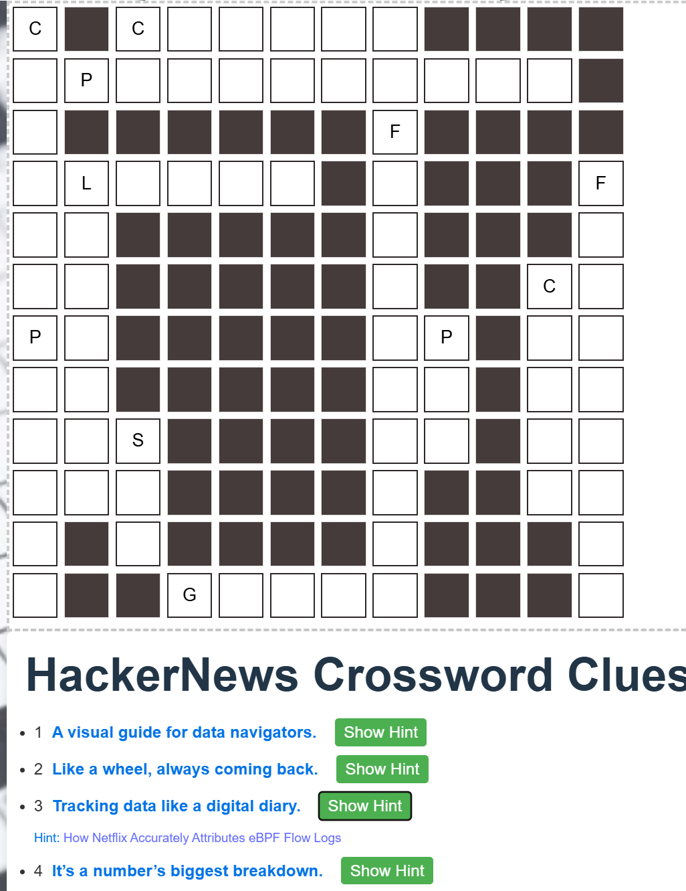

# 🧩 News-Quest

**News-Quest** ist ein Projekt, das aktuelle Nachrichten in Kreuzworträtsel verwandelt. Es bezieht Artikel von Plattformen wie Reddit und Hacker News, verarbeitet sie zu Hinweisen und erstellt daraus interaktive Rätsel. Dieses Projekt demonstriert verschiedene Fähigkeiten, die während eines einjährigen Bootcamps erlernt wurden – darunter API-Integration, Rätselgenerierung und Deployment.

---




## 🚀 Projektumfang

1. **News Fetching**
   - Holt aktuelle Nachrichtenartikel von Reddit und Hacker News über deren APIs.

2. **Kreuzworträtsel-Generierung**
   - Verarbeitet die Artikelinhalte zu Fragen und Antworten.
   - Nutzt die Bibliothek `crossword-puzzle-maker` zur Rätselerstellung.

3. **Frontend**
   - Erstellt mit React.
   - Ermöglicht das Durchstöbern der Headlines sowie das Lösen der generierten Kreuzworträtsel.

4. **Backend**
   - FastAPI stellt eine Schnittstelle bereit, um News abzurufen und Rätsel bereitzustellen.

---

## 🛠️ Technologien

- **Frontend:** React, JavaScript, CSS  
- **Backend:** FastAPI, Python  
- **Datenbank:** SQLite  

---

## ▶️ Projekt lokal ausführen

### 🔐 API-Zugangsdaten
Lege eine `.env`-Datei im Hauptverzeichnis der App an und füge deine Schlüssel hinzu:

```
REDDIT_CLIENT_ID=XXX
REDDIT_CLIENT_SECRET=XXX
newsapi_key=XXX
OPENAI_API_KEY=XXX
```

### 🧠 Backend (FastAPI)

1. Abhängigkeiten installieren:

```
pip install -r server/requirements.txt
```

2. Server starten:

```
cd server
uvicorn app.main:app --reload
```

### 💻 Frontend (React)

1. Abhängigkeiten installieren und Dev-Server starten:

```
cd client
npm install
npm run dev
```

---

## 📌 Hinweise

- Stelle sicher, dass sowohl Backend als auch Frontend parallel laufen.
- Weitere Umgebungsvariablen können je nach API-Zugriff erforderlich sein.

